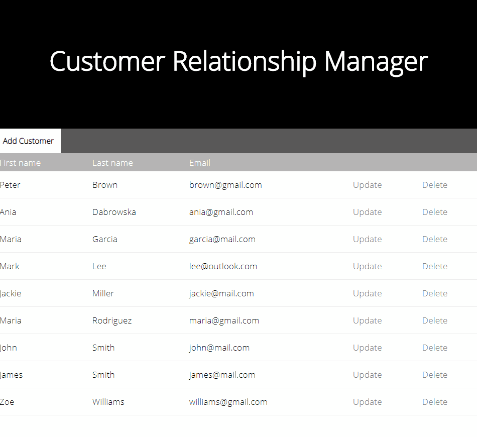
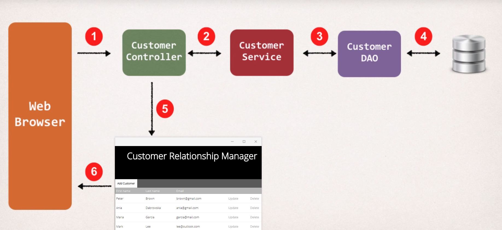

# Client Resource Management(CRM) with Spring MVC and Hibernate

###  Demo

### Overview
This directory contains the source code for the CRUD CRM web application using:
- Maven - Dependency Management
- Spring MVC - The web framework used
- Hibernate - Used to Object Relation Management(ORM) mapping and Entity Validation
- MySQL Database - Relational Database Used
- Tomcat - Open Source web server and servlet container

